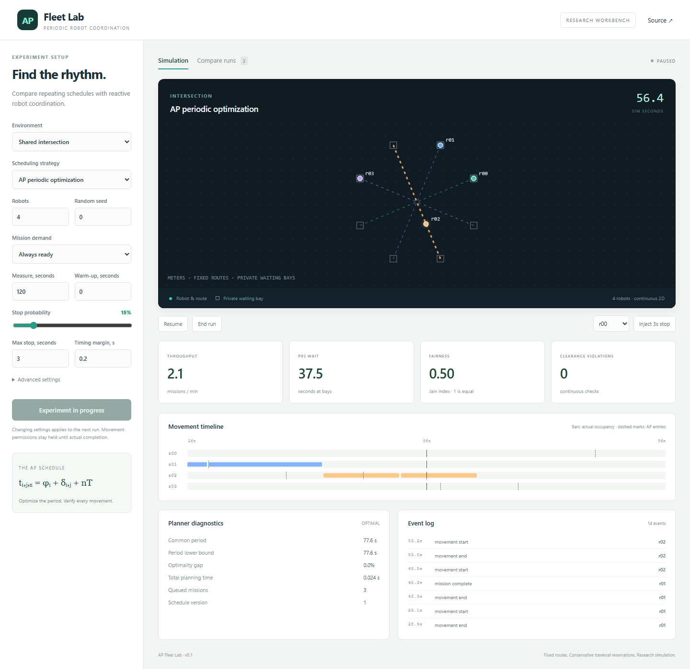

# AP Fleet Lab

A local research workbench for **arithmetic-progression schedules and robot throughput**. Robots follow fixed cyclic routes in continuous 2D space; compare FCFS, optimized periodic schedules, and nonperiodic rolling-window optimization under paired demand and disruption seeds.



[Watch the recorded demo](docs/demo.webm)

## Start locally

Requires **Python 3.12 or 3.13**, Node.js 22+, and npm. Use Python 3.12 for the committed dependency lock. The service binds to localhost and has no user authentication.

```powershell
py -3.12 -m venv .venv
.\.venv\Scripts\python.exe -m pip install -r requirements.lock
.\.venv\Scripts\python.exe -m pip install --no-deps -e .
cd frontend
npm ci
npm run build
cd ..
.\.venv\Scripts\python.exe -m ap_fleet.cli serve
```

Open **http://127.0.0.1:8000**. On Linux/macOS use `python3.12` and `.venv/bin/python` instead of the Windows Python commands. For UI development run `npm run dev` in `frontend` while the API runs on port 8000; Vite proxies REST and WebSocket requests.

The UI supports scenario selection and JSON upload, fleet/demand/delay controls, robot motion, planned-versus-actual timelines, live metrics, manual stops, pause/resume, comparison history, replay, and compressed export. Changed settings create new runs. Manual stops take effect at the next zero-speed waypoint; permission remains held while stopped.

## Headless experiments

```powershell
.\.venv\Scripts\python.exe -m ap_fleet.cli run --algorithm periodic --scenario intersection --fleet 4 --duration 120 --artifact data/example.jsonl.gz
.\.venv\Scripts\python.exe -m ap_fleet.cli benchmark --output benchmark-output/full
```

The full suite contains **4,320 runs**: 3 environments × 4 fleet sizes (4/8/16/32) × 3 demand patterns × 2 disruption profiles × 20 seeds × 3 algorithms. Each run has 60 seconds of warm-up and a 600-second measurement window. This is a batch workload; use `--resume` to continue an interrupted suite. Completed cases are flushed individually.

A smaller, still paired experiment:

```powershell
.\.venv\Scripts\python.exe -m ap_fleet.cli benchmark --scenarios intersection --fleets 4 --demands saturated intermittent bursts --profiles none mixed --seeds 20 --warmup 60 --duration 600 --output benchmark-output/intersection
```

Outputs include raw `results.jsonl`, `summary.csv`, `paired-comparisons.json`, and `report.md`. Every result records configuration, seed, dependency versions, Git commit, dirty state, and solver diagnostics. Live run history is persisted in SQLite; replay snapshots and complete events are stored in gzip JSONL.

Read the [research design](docs/design.md), [benchmark results](docs/results/README.md), and [extension experiments](docs/research.md). Results need not favor AP.

## Model and limits

- Disc robots follow fixed polylines with acceleration-limited triangular/trapezoidal motion. They stop at corners and private bays.
- Private bays must be clear of every other robot's swept route. Incompatible traversals are serialized for their **entire movement**; this is deliberately conservative.
- AP optimizes a shared cycle and per-traversal offsets. Every robot receives one mission per cycle; irregular demand can leave slots unused.
- Rolling optimization covers **one pending traversal per ready robot**, freezing active movements. It is a scheduling baseline, not a full MAPF solver.
- Admission depends on actual completion, and temporal margins apply to all strategies. Stops/slowdowns never automatically expire permissions.
- An independent continuous checker minimizes disc separation between motion breakpoints. A violation fails a run. Zero observed violations does not certify physical robots.
- Planning timeout without a feasible schedule disables affected admission; it does not silently switch to FCFS.
- A shared fixed period can be inefficient for heterogeneous routes. At large fleet sizes, a 600-second window may cover less than one full cycle; check period and per-robot completions before interpreting fairness.

## Checks

```powershell
.\.venv\Scripts\python.exe -m pytest -q --basetemp=.pytest_cache/temp
cd frontend
npm test
npm run build
```

GitHub Actions runs backend tests on Windows and Linux, a short benchmark, frontend checks, and Chromium end-to-end tests. To run browser checks locally, use `npx playwright install chromium` then `npm run test:e2e` in `frontend`. Source and third-party dependencies are independently licensed. This repository uses original code; it does not copy the cited implementations.

## Prior work

Periodic schedules themselves are established research:

- Kasaura et al., [Periodic Multi-Agent Path Planning](https://arxiv.org/abs/2301.10910), AAAI 2023; [reference implementation](https://github.com/omron-sinicx/PeriodicMAPP).
- Rezende et al., [Safe coordination of robots in cyclic paths](https://doi.org/10.1016/j.isatra.2020.09.019), ISA Transactions 2021.
- Tan et al., [Robust Multi-Agent Pathfinding with Continuous Time](https://ojs.aaai.org/index.php/ICAPS/article/view/31519), ICAPS 2024.
- Li et al., [Lifelong Multi-Agent Path Finding in Large-Scale Warehouses](https://arxiv.org/abs/2005.07371).
- Hönig et al., [Provably Safe and Deadlock-Free Execution of Multi-Robot Plans under Delaying Disturbances](https://arxiv.org/abs/1603.08582).
- [OR-Tools scheduling documentation](https://developers.google.com/optimization/scheduling/job_shop).

MIT license for original project code.
