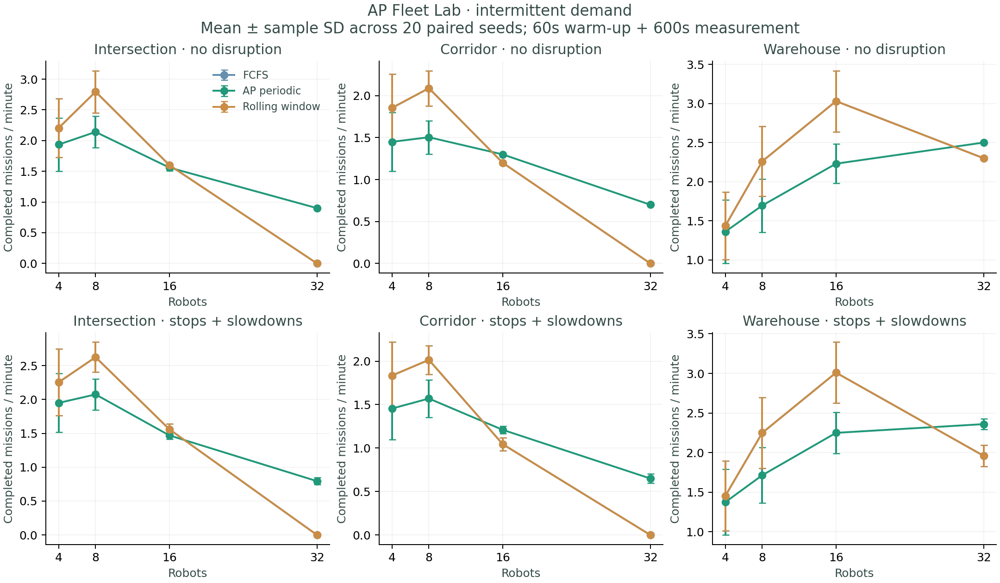
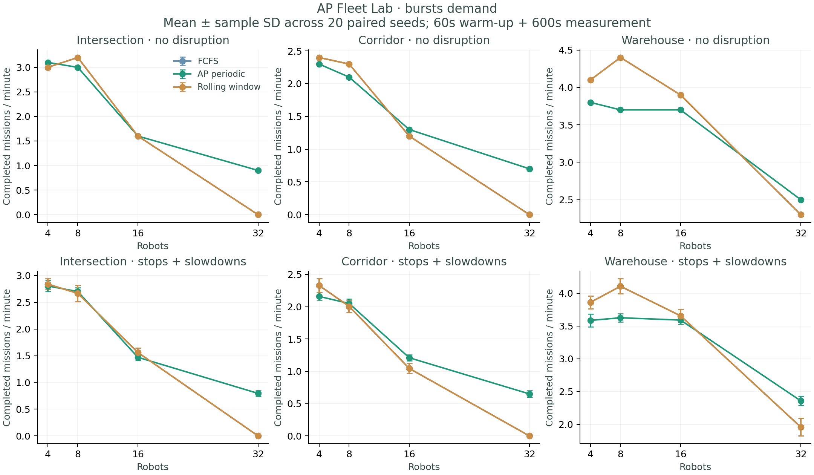

# Experiment overview

Executed **4,320 runs**: 20 paired seeds for all 72 environment/fleet/demand/disruption conditions, using three strategies. 0 runs did not complete; 0 continuous clearance violations were observed.

The experiment uses four worker processes and a two-second budget for each solver call. Planning latency includes model construction. Raw records preserve source revision, dirty state, dependency versions, configuration and solver status. Earlier solver cases and intermittent-demand cases were regenerated after exact clique reductions and fleet-normalized arrivals; the benchmark is not a single-revision historical dataset.

## AP comparisons

Counts below compare the AP throughput to each baseline for individual paired seeds, using a 1e-9 missions/min tie tolerance. They do not establish general superiority.

| Baseline | AP wins | Ties | AP losses |
|---|---:|---:|---:|
| fcfs | 570 | 144 | 726 |
| rolling | 570 | 144 | 726 |

## Finite-window caveat

At larger fleets, the shared period can exceed the complete 660-second run. FCFS may perform first traversals for many robots before any complete mission, while AP's initial hint groups a robot's traversals. Mission-completion throughput and fairness can therefore reflect initialization and measurement boundaries. Do not interpret those cases as steady-state capacity. Future experiments should warm up for several computed cycles, then measure many more cycles.

## Figures

See [full tables](report.md), [CSV summary](summary.csv), [paired comparisons](paired-comparisons.json), and [compressed raw records](results.jsonl.gz). Whole-traversal serialization and private bays limit applicability; no physical controller was tested.
